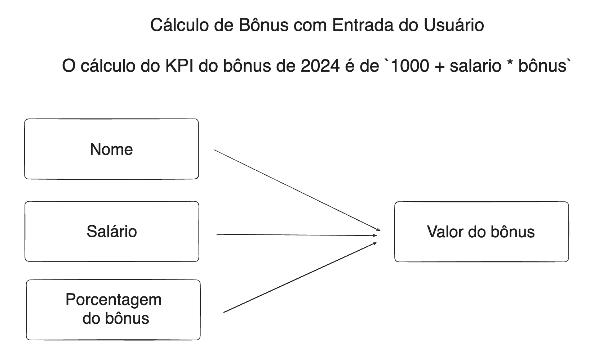

# Aula 01 - Variáveis em Python

> É essencial assistir ao [vídeo](https://youtu.be/-M4pMd2yQOM) de configuração do ambiente!

## Python

- Para identificar se o **Python** está **instalado** na máquina, abra um terminal (Prompt de Comando, Powershell, Git Bash, etc.) e execute o comando:

	```bash
	python --version
	```

	- Se o Python estiver instalado, a versão instalada será exibida.

- Precisamos de uma **linguagem de programação** para nos "comunicar" com o computador de uma forma que é inteligível para um humano.

- Como a **linguagem de máquina** é **binária**, é necessário um **interpretador** que traduz a linguagem de programação para a linguagem de máquina.

	- Por exemplo, quando instalamos o **Python**, estamos instalando um **interpretador** que é capaz de traduzir códigos escritos na linguagem de programação Python para a linguagem de máquina do nosso computador.

- **Python** é uma **linguagem de programação *interpretada***, o que significa que, ao contrário de uma **linguagem compilada**, o código é traduzido em **tempo de execução**.

- Essa característica, inclusive, permite que o Python interaja com pacotes que são escritos em outras linguagens de programação, por exemplo:

	- Numpy (C++)
	- DuckDB (C++)
	- Polars (Rust)
	- Spark (Scala/Java)

## VS Code

- **VS Code** é um dos **editores de código** mais utilizados no mercado.

- Funciona com praticamente todas as linguagens de programação.

- Possui extensões que facilitam o desenvolvimento e aumentam a produtividade.

- Com a extensão de **Python**, podemos executar programas direto no VS Code.

## Git

- **Git** é um ferramenta de **versionamento de código**.

- Com ele, temos um **histórico de modificações** realizadas no código. Além disso, podemos **restaurar** versões anteriores do código.

- Antes de realizar **commits** nos repositórios versionados com **Git**, é necessário **configurar** os **dados do usuário**:

	```bash
	git config --global user.name "<User Name>"
	git config --global user.email "<user@email.com>"
	```

## GitHub

- O **GitHub** é um **repositório online** de códigos.

- Podemos **sincronizar** nosso **repositório local** a um **repositório remoto** hospedado no GitHub. Com isso, teremos acesso ao código a partir de qualquer máquina.

- Com o GitHub, também é possível desenvolver código de maneira **colaborativa**, uma vez que podemos configurar um repositório como público.

## Comandos Básicos de Python

### Função `print()`

- A **função `print`** é utilizada para **exibir texto** no terminal.

- A função aceita qualquer tipo de objeto como **argumento** (entre os parênteses).

#### Exemplos

- Exibindo uma **string**:

	```python
	print("Hello, world!")
	
	# Output:
	# Hello, world!
	```

- Exibindo o resultado de uma operação com um **inteiro** e um **float**:

	```python
	print(7 + 1.3)
	
	# Output:
	# 8.3
	```

- Exibindo uma **lista**:

	```python
	print([1, 2, 'a', 'b'])
	
	# Output:
	# [1, 2, 'a', 'b']
	```

- Exibindo **múltiplos argumentos**:

	```python
	print("Hello", 13, 3.14)
	
	# Output:
	# Hello 13 3.14
	```

### Função `input()`

- A **função `input`** é utilizada para capturar uma **entrada de dados** do usuário.

- A função tem como **parâmetro** o **prompt** que será exibido para o usuário solicitando sua entrada.

- Quando esta função é processada, a **execução** do programa é **pausada** enquanto aguarda que o usuário digite sua entrada no terminal e pressione `Enter`.

- A função **retorna** a entrada do usuário sempre no formato de **string**, que pode ser posteriormente utilizada no programa.

#### Considerações Importantes

- Como o retorno da função é sempre uma **string**, caso precisemos tratá-lo como um valor **numérico**, é necessário fazer a sua **conversão** (**casting**) para o formato adequado usando, por exemplo, as funções `int()` ou `float()`.

- Ao usar `input()` para receber dados do usuário, é importante considerar a **validação** desses dados, especialmente se eles forem usados em **operações críticas** ou transmitidos a outras partes do sistema.

- O **prompt** deve ser **claro e informativo** para guiar o usuário sobre o que precisa ser inserido, melhorando a sua usabilidade e a experiência.

#### Exemplos

- **Solicitando** a **entrada** do usuário:

	```python
	input("Digite seu nome: ")
	
	# Output
	# Digite seu nome: <input>
	```

- **Usando** a entrada do usuário em uma **operação**:

	```python
	print("Olá, " + input("Digite seu nome: ") + "!")
	
	# Output
	# Digite seu nome: Kaio [Enter]
	# Olá, Kaio!
	```
	
    > Note que podemos **"somar"** **strings**.

- **Convertendo** a entrada do usuário em um **valor inteiro**:

	```python
	print(
	    int(input("Digite um inteiro: ")) +
	    float(input("Digite um float: "))
	)
	
	# Output
	# Digite um inteiro: 7 [Enter]
	# Digite um float: 1.3 [Enter]
	# 8.3
	```

	> Caso a conversão não tivesse sido realizada, a saída seria `71.3`. Este é um tipo de **erro difícil de detectar**, pois o programa executa normalmente, mas seu resultado não é o desejado.

### Variáveis


- Em programação, as **variáveis** são fundamentais, pois funcionam como **"recipientes"** que **armazenam** dados intermediários na **memória**, para que possam ser **reutilizados** e possivelmente **modificados** ao longo da execução de um programa.

- **Python** é uma linguagem com **tipagem forte**, o que significa que os dados possuem **tipos bem definidos** e esses tipos **definem o comportamento** dos dados nas operações.

- **Python** tem **tipagem dinâmica**, ou seja, o **tipo de um dado** só é **determinado** **durante a execução** do programa, e isso é feito de forma **automática**.

	- Isso implica, por exemplo, que uma mesma **variável** pode armazenar dados de **diferentes tipos** ao longo da execução do programa.

	- **Mudar** o **tipo de dado** de uma variável durante o programa **não é uma boa prática**!

- Em **Python**, **atribuímos** um **valor** a uma **variável** usando o operador `=`.
	- Este operador não tem o mesmo significado de igualdade da matemática.

### Nomes de Variáveis

- Em **Python**, há algumas **regras** e **convenções** para os **nomes das variáveis**:

	- Os nomes podem conter **letras**, **números** e **underscores** (`_`)

	- Os nomes **não** podem **começar** com um **número**.

	- Os nomes de variáveis são **case-sensitive**, o que significa que `variavel`, `Variavel` e `VARIaVEL` são consideradas três variáveis diferentes.

	- Existem algumas **palavras reservadas**, que não podem ser usadas como nomes de variáveis, como `if`, `for`, `class`, entre outras.

	- É recomendado seguir a **convenção** **snake_case** para nomes de variáveis que consistem em mais de uma palavra, como `nome_usuario` ou `total_pedidos`.

### Escopo de Variáveis

- O **escopo** de uma **variável** determina onde ela é acessível dentro do código.

- Variáveis definidas na **porção principal** do programa são **globalmente acessíveis**.

- Já variáveis definidas **dentro de funções** são **locais** a essas funções, a menos que sejam **explicitamente declaradas** como **globais** usando o denominador `global`.

### Tipos de Dados

- Em **Python**, os principais **tipos de dados** são:

	- Booleano (`bool`)
	- Inteiro (`int`)
	- Ponto flutuante (`float`)
	- String (`str`)
	- Lista (`list`)
	- Tupla (`tuple`)
	- Dicionário (`dict`)

- Para **verificar** o **tipo de dado** de uma **variável** em Python, podemos utilizar a **função `type()`**.

#### Exemplos

- **Criando** variáveis de **vários tipos**:

	```python
	a = True                # Booleano
	b = 13                  # Inteiro
	c = 3.14                # Float
	d = "Hello"             # String
	e = [1, 2, 3]           # Lista
	f = (1, 2, 3)           # Tupla
	g = {"a": 1, "b": 2}    # Dicionário
	```

- **Atribuindo** uma **entrada** de usuário a uma **variável**:

	```python
	name = input("Digite seu nome: ")
    
    # Usando a variável
	print(f"Olá, {name}!")
	```
	
    > Note que utilizamos uma ***f-string***, de forma que podemos utilizar variáveis dentro da string sem precisar somar suas diferentes partes.

- **Mudando** o **tipo de dado** de uma variável:

	```python
	a = 100
    print(type(a))

    a = "Hello"
    print(type(a))

    # Output
	# <class 'int'>
	# <class 'str'>
	```

	> Mudar o tipo de dado de uma variável **não é uma boa prática**!

## Exercícios

- Confira os exercícios e as soluções na pasta [`exercicios`](https://github.com/kaiodt/bootcamp-data-eng/tree/main/aula_01/exercicios).

## Desafio

- Escreva um programa em Python que solicita ao usuário para digitar seu nome, o valor do seu salário mensal e o valor do bônus que recebeu.

- O programa deve, então, imprimir uma mensagem saudando o usuário pelo nome e informando o valor do salário em comparação com o bônus recebido.

<p align="center">
  
</p>

### **Exemplo:**

```python
# Digite seu nome: Kaio
# Digite seu salário: 5000
# Digite o seu bônus: 1.5

# Olá Kaio, o seu bônus foi de 8500.
```

### **Solução:**

- Confira o arquivo [`desafio.py`](https://github.com/kaiodt/bootcamp-data-eng/blob/main/aula_01/desafio.py).