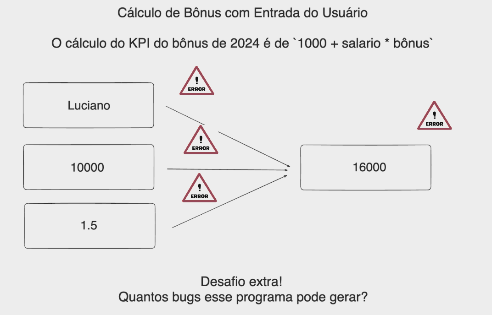

# Aula 02 - TypeError, Type Check, Type Conversion, try-except e if

- Boa parte do desenvolvimento de um programa é dedicada a pensar em como **prevenir erros**.

- Nesta aula:
	- Revisão e aprofundamento nos tipos de dados do Python.

	- Tipos de erros que podem acontecer em Python, bem como estratégias de como contorná-los e tratá-los.

## Tipos Primitivos de Dados

- Como mencionado na [Aula 01](https://github.com/kaiodt/bootcamp-data-eng/tree/main/aula_01), os **tipos primitivos** de dados **mais básicos** em **Python** são:

	- Inteiros (`int`)
	- Números de ponto flutuante (`float`)
	- Strings (`str`)
	- Booleanos (`bool`)

- Cada tipo possui uma série de **operações** e **métodos** próprios que podem ser utilizados para **manipular** seus **valores**.

- A seguir, são listadas algumas das principais **operações** e **métodos** dos **tipos primitivos** de dados.

### Inteiros (`int`)

- `+` → Adição
- `-` → Subtração
- `*` → Multiplicação
- `/` → Divisão
- `//` → Divisão inteira (quociente da divisão)
- `%` → Módulo (resto da divisão)
- `**` → Exponenciação

### Números de Ponto Flutuante (`float`)

- `+` → Adição
- `-` → Subtração
- `*` → Multiplicação
- `/` → Divisão
- `//` → Divisão inteira (quociente da divisão)
- `%` → Módulo (resto da divisão)
- `**` → Exponenciação

### Strings (`str`)

- `+` → Concatenação
- `*` → Repetição
- `.upper()` → Conversão em maiúsculas
- `.lower()` → Conversão em minúsculas
- `.split(sep)` → Divide a string em uma lista, utilizando `sep` como separador
- `.strip()` → Remove espaços em branco existentes no início e no final da string

### Booleanos (`bool`)

- `and` → Operador lógico **E** (`True` somente se os dois operandos são `True`)
- `or` → Operador lógico **OU** (`True` se pelo menos um dos operandos é `True`)
- `not` → Operador lógico **NÃO** (`False` se o operando é `True` e vice-versa)
- `==` → Operador de comparação de **igualdade**
- `!=` → Operador de comparação de **diferença**

## Exercícios

### Inteiros (`int`)

- Veja os **exercícios de 01 a 05** na pasta [`exercícios`](https://github.com/kaiodt/bootcamp-data-eng/tree/main/aula_02/exercicios).

### Números de Ponto Flutuante (`float`)

- Veja os **exercícios de 06 a 10** na pasta [`exercícios`](https://github.com/kaiodt/bootcamp-data-eng/tree/main/aula_02/exercicios).

### Strings (`str`)

- Veja os **exercícios de 11 a 15** na pasta [`exercícios`](https://github.com/kaiodt/bootcamp-data-eng/tree/main/aula_02/exercicios).

### Booleanos (`bool`)

- Veja os **exercícios de 16 a 20** na pasta [`exercícios`](https://github.com/kaiodt/bootcamp-data-eng/tree/main/aula_02/exercicios).

## TypeError, Type Check e Type Conversion em Python

- **Python** é uma linguagem de programação com **tipagem forte** e **dinâmica**, tal que não é necessário declarar os tipos das variáveis explicitamente, pois ele é determinado pelo valor que ela armazena.

- Por isso, é necessário compreender como o Python lida com diferentes tipos de dados, especialmente quando se trata de operações que envolvem múltiplos tipos.

### Type Error

- Existem diversos **tipos de erros** em Python, também chamados de **exceções**.

- Um deles é o `TypeError`, que ocorre quando uma **operação** ou **função** é aplicada a um **objeto** cujo **tipo** é **inadequado**.

#### Exemplo

- Um exemplo de `TypeError` é quando tentamos usar a função `len()` para medir o comprimento de um número inteiro:

	```python
	print(len(7))
	# TypeError: object of type 'int' has no len()
	```

	- O `TypeError` ocorre, pois esta função não espera um objeto do tipo `int` como argumento.

### Type Check

- Em **Python**, é possível fazer uma **verificação do tipo** (**type check**) de um objeto.

- Com isso podemos **garantir** que determinadas **operações** ou **funções** sejam aplicadas apenas a **tipos de dados compatíveis**, evitando **erros** em **tempo de execução**.

#### Exemplos

Para determinar o **tipo de dados** de um objeto, podemos utilizar a **função `type()`**:

	```python
	print(type(7))                   # <class 'int'>
	print(type(3.14))                # <class 'float'>
	print(type("Hello"))             # <class 'str'>
	print(type(True))                # <class 'bool'>
	print(type([1, 2, 3]))           # <class 'list'>
	print(type((1, 2, 3)))           # <class 'tuple'>
	print(type({"a": 1, "b": 2}))    # <class 'dict'>
	```

- Para **testar** se um objeto é de **determinado tipo**, usamos a **função `isinstance()`**:

	```python
	print(isinstance(7, int))                    # True
	print(isinstance(3.14, int))                 # False
	print(isinstance("Hello", str))              # True
	print(isinstance("True", bool))              # False
	print(isinstance([1, 2, 3], list))           # True
	print(isinstance((1, 2, 3), tuple))          # True
	print(isinstance({"a": 1, "b": 2}, dict))    # True
	```

	- Note que a função **retorna** um valor **booleano** (`True` ou `False`), dependendo do tipo do objeto.

### Type Conversion

- **Conversão de tipo** (**type conversion**), também conhecido como **casting**, é o processo de **converter** o valor de um objeto de um tipo para outro.

- Em **Python**, cada **tipo** existente possui uma **função homônima** que serve para **transformar** o valor do objeto passado como argumento para o tipo daquela função. Por exemplo, `int()`, `float()`, `str()`, etc.

- Como visto na [Aula 01](https://github.com/kaiodt/bootcamp-data-eng/tree/main/aula_01), o **casting** é muito utilizado para **converter** a **entrada do usuário** para um tipo adequado.

#### Exemplo

- Convertendo um número em formato string para float e realizando uma operação:

	```python
    print(float("3.14") + 4.25)
    # Output: 7.39
    ```

### Tratamento de Erros com `try-except`

- Uma **exceção** é um **erro** que ocorre **durante a execução** do programa e que, se não tratado, **interrompe o fluxo** normal do programa e **termina sua execução**.

- A **estrutura `try-except`** é usada para **tratamento de exceções** em Python, permitindo que o programa lide com os erros de maneira elegante, **sem interrupção** da sua execução.

	- **`try`:** Este é o **primeiro bloco** da estrutura de tratamento de exceções. O Python **tenta executar** o código dentro deste bloco.

	- **`except`:** Se uma exceção ocorrer no bloco `try`, a execução imediatamente salta para o bloco `except`, onde o **erro deve ser tratado**. Podemos **especificar** individualmente **tratamentos** para cada **tipo de exceção** passíveis de ocorrer. Se nenhum tipo de exceção for especificado, o mesmo tratamento será aplicado para todas as exceções.

#### Exemplos


- Tratando um erro de **divisão por zero**:

	```python
    try:
	    # Trecho de código que pode gerar uma exceção
	    result = 10 / 0
	    
	except ZeroDivisionError:
		# Código executado se a exceção ocorrer
		print("Divisão por zero não é permitida.")
		
    else:
	    # Código executado somente se são houve exceção
	    print("Código executado com sucesso!")
	    
	finally:
		# Código executado independente da ocorrência de exceções
		print("Sempre executado.")
	```

- Tratando uma **exceção genérica**:

	```python
    try:
	    # Trecho de código que pode gerar uma exceção
	    length = len(10)
	
	except Exception as e:
		# Apresentando o tipo de erro
		print(type(e))
		
		# Apresentando a mensagem de erro
		print(e)
		
    else:
	    # Código executado somente se são houve exceção
	    print("Código executado com sucesso!")
	    
	finally:
		# Código executado independente da ocorrência de exceções
		print("Sempre executado.")
	```

### Controle de Fluxo com `if`

- O **`if`** é uma estrutura de **controle de fluxo** que permite ao programa executar diferentes ações com base em diferentes **condições**.

- Se a condição avaliada pelo `if` for verdadeira (`True`), o bloco de código indentado sob ele será executado. Se a condição for falsa (`False`), o bloco de código será ignorado.

- **Estrutura completa:**

	- **`if`:** Avalia uma condição. Se a condição for verdadeira, executa o bloco de código associado.

	- **`elif`:** Abreviação de "`else if`". Permite verificar múltiplas condições em sequência.

	- **`else`:** Executa um bloco de código se todas as condições anteriores no `if` e `elif` forem falsas.

#### Exemplo

```python
age = 20
if age < 18:
    print("Menor de idade.")
elif age == 18:
    print("Exatamente 18 anos.")
else:
    print("Maior de idade.")
```

## Exercícios

- Veja os **exercícios de 21 a 25** na pasta [`exercícios`](https://github.com/kaiodt/bootcamp-data-eng/tree/main/aula_02/exercicios).

## Desafio

- Refatore o [desafio](https://github.com/kaiodt/bootcamp-data-eng/blob/main/aula_01/desafio.py) da [Aula 01](https://github.com/kaiodt/bootcamp-data-eng/tree/main/aula_01) evitando bugs onde é possível que possam acontecer.

- Para tratar entradas inválidas que não podem ser convertidas para um número de ponto flutuante e prevenção de valores negativos para salário e bônus, você pode modificar o código diretamente.

- Isso envolve adicionar verificações adicionais após a tentativa de conversão para garantir que os valores sejam positivos.

<p align="center">
  
</p>

### **Solução:**

- Confira o arquivo [`desafio.py`](https://github.com/kaiodt/bootcamp-data-eng/blob/main/aula_02/desafio.py).

