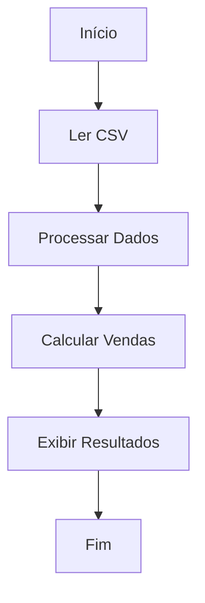

# Aula 07 - Funções em Python e Estruturas de Dados - Parte 1

## Funções em Python

- As **funções** em Python são uma das **estruturas fundamentais** da linguagem, permitindo a **reutilização de código** e conferindo **organização** e **modularidade** aos programas.

- Esta **aula** aborda desde a **motivação** até a **aplicação prática** de **funções**, incluindo **keywords**, **nomes**, e como **utilizá-las** efetivamente.


### Motivação

- A principal **motivação** para usar **funções** em **Python** é a **reutilização de código**.

- **Funções** permitem que você **escreva** um **bloco de código** uma **única vez** e o **execute múltiplas vezes**, possivelmente com **diferentes** **argumentos**, produzindo comportamentos e resultados diferentes.

- Assim, as **funções** tornam o código mais **legível**, **modular** e de **fácil manutenção**.


### Definindo Funções

- Para **definir** uma **função** em **Python**, usamos a keyword **`def`**, seguida do **nome** da função, **parênteses** **`()`** contendo **zero ou mais** **parâmetros**, e dois pontos **`:`**. Esta linha é chamada de **assinatura da função**.

- O **corpo da função** corresponde ao **bloco de código indentado** após sua assinatura.

```python
def my_function():
    return "Hello, World!"
```

### Nomes de Funções

- Os **nomes das funções** seguem as **mesmas regras** de **nomes de variáveis** em **Python**:

	- **Podem** conter **letras**, **números** (exceto o primeiro caractere) e **underscores** (`_`).
	- **Não** **podem** conter **espaços** ou **caracteres especiais**.
	- Devem ser **descritivos** e, por **convenção**, utilizam **`snake_case`**.


### Parâmetros e Argumentos

- **Parâmetros** são as variáveis listadas nos parênteses na definição da função. Eles são como placeholders para os dados que a função irá processar.

- **Argumentos** são os valores reais passados para a função quando ela é chamada.

```python
def my_sum(a, b):
    return a + b
```


### Keywords Importantes

- **`def`** inicia a **definição** de uma função.

- **`return`** é usado para **retornar** um **valor** da função. Se **omitido**, a função retorna **`None`** por **padrão**.

- **`pass`** pode ser usado como um placeholder para uma **função vazia**, significando "nada". Utilizamos quando sabemos que vamos precisar de uma função, mas ainda não sabemos como implementá-la.


### Chamando Funções

- Até agora, tratamos apenas da definição de uma função.

- Para de fato executar a função definida, precisamos "chamá-la" usando seu nome seguido por parênteses contendo os argumentos desejados.

	```python
	result = my_sum(5, 3)
	
	print(result)  # Output: 8
	```

### Valores Padrão e Argumentos Nomeados

- Funções podem ter **parâmetros** com **valores padrão**, de forma que não precisamos passar argumentos para eles, caso desejemos usar os valores padrão.

	```python
	def greeting(name, message="Olá"):
	    print(f"{message}, {name}!")

	print(greeting("Kaio"))  # Output: Olá, Kaio!
	```

- Também é possível chamar funções com **argumentos nomeados** para maior clareza.

	```python
	greeting(message="Bem-vindo", name="Kaio")
	```

	- Note que, ao usar argumentos nomeados, podemos **mudar** a **ordem** dos **parâmetros**.


## Exercícios

- Veja os exercícios na pasta [`exercicios`](https://github.com/kaiodt/bootcamp-data-eng/tree/main/aula_07/exercicios).


## Desafio - Análise de Vendas de Produtos

### Objetivo

- Dado um arquivo `csv` contendo dados de vendas de produtos, o desafio consiste em ler os dados, processá-los em um dicionário para análise e, por fim, calcular e reportar as vendas totais por categoria de produto.

### Fluxo



### Tarefas

1. Ler o arquivo `csv` e carregar os dados.

2. Processar os dados em um dicionário, onde as chaves são as categorias e os valores são listas de dicionários, cada um contendo as informações de um produto: `Produto`, `Quantidade`, `Venda`.

3. Calcular o total de vendas (`Quantidade` * `Venda`) por categoria.


### Funções

- **Ler CSV**:
	- Função: `read_csv`.
	- Entrada: Nome do arquivo `csv`.
	- Saída: Lista de dicionários com dados lidos.

- **Processar Dados**:
	- Função: `group_by_category`.
	- Entrada: Lista de dicionários (saída de `read_csv`).
	- Saída: Dicionário no formato descrito acima.

- **Calcular Vendas por Categoria**:
	- Função: `compute_sales_by_category`.
	- Entrada: Dicionário processado (saída de `group_by_category`).
	- Saída: Dicionário com total de vendas por categoria.


### Solução

- Confira na pasta [`desafio`](https://github.com/kaiodt/bootcamp-data-eng/blob/main/aula_07/desafio).
