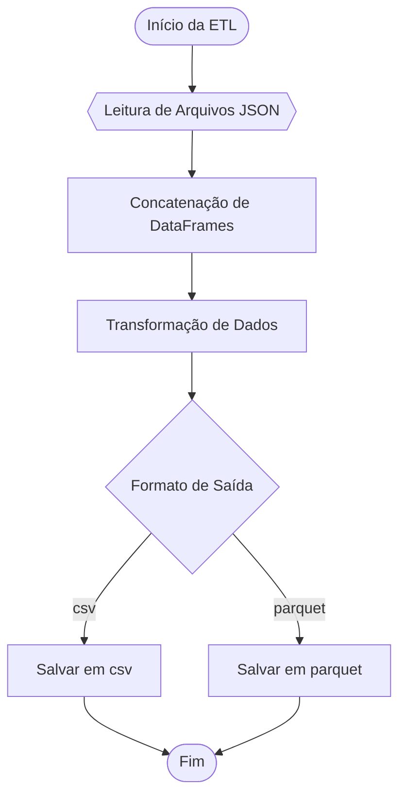
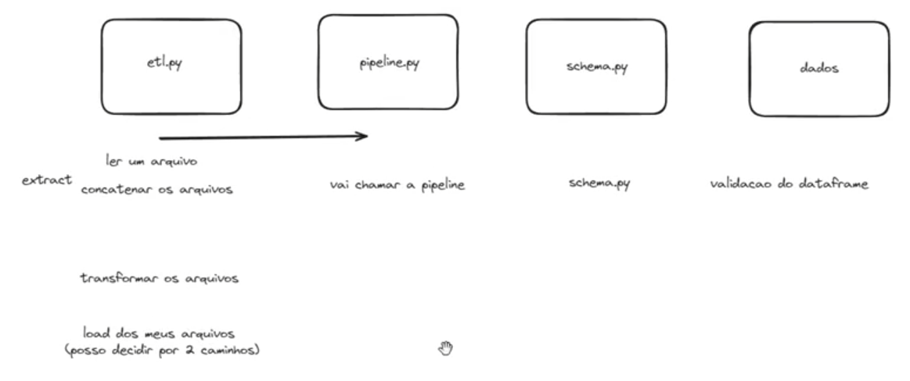

# Aula 08 - Funções em Python e Estruturas de Dados - Parte 2

- Nesta aula, continuaremos o estudo das **funções** em **Python**, focando no desenvolvimento de um **projeto de ETL simples**.

## Projeto de ETL

- Neste projeto, simulamos um **e-commerce** onde uma **API** gera **dados** sobre **vendas diárias**.

- Para cada dia, um **arquivo JSON** contendo **informações** sobre as **vendas** de **produtos** é **gerado**.

- O **objetivo** é fazer a **ingestão** desses **arquivos JSON**, **concatená-los** em uma estrutura de dados única, aplicar uma **transformação** para **calcular** o **total em vendas** de **cada item** e **gerar** um **arquivo consolidado**, que pode ser no formato **`csv`**, **`parquet`**, ou **ambos**.

### Fluxo do Programa

### Planejamento

- Para **planejar** uma **solução** para o **projeto**, começamos com a **seleção das ferramentas** a serem utlizadas.

- Em termos de **ferramentas de processamento**, temos algumas **opções**, como:

	- Pandas
	- Polars
	- DuckDB
	- Spark
	- Dask

- Vamos utilizar a ferramenta **Pandas**, pela sua **versatilidade** e **desempenho suficiente** para o **volume de dados** em questão.

- Em termos de **ferramentas de qualidade**, consideramos duas **opções**:

	- **Pandera** - Ideal quando tratamos com **queries SQL** e **DataFrames**.

	- **Pydantic** - Ideal para uso de **estruturas do Python puro**, **APIs** e **processamento linha a linha**.

- Como vamos utilizar o **Pandas**, a ferramenta de qualidade mais adequada é o **Pandera**.

### Estrutura do Código

- Vamos **separar** o **código** da solução em **módulos**, conforme a figura:

  

### Solução

- Confira os arquivos [`schema.py`](https://github.com/kaiodt/bootcamp-data-eng/blob/main/aula_08/schema.py), [`etl.py`](https://github.com/kaiodt/bootcamp-data-eng/blob/main/aula_08/etl.py) e [`pipeline.py`](https://github.com/kaiodt/bootcamp-data-eng/blob/main/aula_08/pipeline.py).
