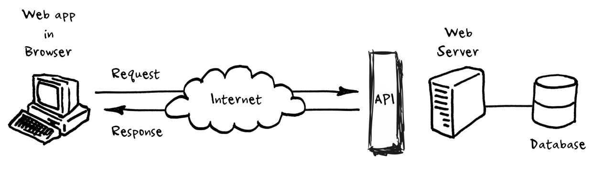

# Aula 18 - O que é uma API - Request, Pydantic e Fazendo Nosso CRUD

- Nesta aula, vamos revisar alguns conceitos sobre **APIs**, especialmente **APIs REST**, bem como iniciar um projeto em **Python** para **consumir dados** de uma **API**, **validar** os dados recebidos de acordo com um modelo definido com **Pydantic** e **salvá-los** em um **banco de dados** usando a biblioteca **SQLAlchemy**.

- Também vamos aprender sobre a **arquitetura** **Model-View-Controller** (**MVC**).


## Revisão de APIs

- Conforme visto na [Aula 15](https://github.com/kaiodt/bootcamp-data-eng/tree/main/aula_15), uma ***API*** (***Application Programming Interface***) refere-se a um conjunto de **rotinas e padrões** (**contratos**) estabelecidos por uma **aplicação**, para que **outras aplicações** possam utilizar suas funcionalidades.

- Uma **API** também funciona como uma **camada de abstração** sobre as funcionalidades de um **sistema**, por exemplo, um serviço na Web.

- Este serviço funciona a partir de um **servidor**, e se conecta a um **banco de dados**. Entretanto, não estamos interessados em nenhum detalhe de implementação desse serviço. Apenas em **dados** que ele possa **fornecer**.

- Então, o **serviço** implementa uma **API**, de forma que os **usuários** possam fazer **requisições** de **dados** para ele, por meio da **internet**, por exemplo, e ele possa **entregar** esses **dados**.

- Além disso, essa **API** **determina** as **regras** a respeito dessa **comunicação**, ou seja, define como devem ser as **requisições** e como se darão as **respostas**. Dessa forma, é **estabelecido** um **contrato** entre as partes.

- Comumente, esse **contrato** segue uma **arquitetura** chamada **REST** (**RE**presentational **S**tate **T**ransfer).

<p align="center">
  
</p>


## Consumindo Dados de uma API

- Agora, vamos praticar os conceitos sobre APIs consumindo dados de uma. No caso, usar a [PokéAPI](https://pokeapi.co/), uma API que fornece dados sobre Pokémons.

- Para isso, vamos utilizar a **biblioteca** [**`requests`**](https://requests.readthedocs.io/en/latest/) do **Python**, a mais utilizada para **interagir** com **sites** e **APIs**.

- De acordo com a **documentação** da **API**, para obter **informações** sobre determinado **Pokémon**, devemos usar o **endpoint** `https://pokeapi.co/api/v2/pokemon/{id ou nome}`.

- Suponha que estamos interessados apenas no **nome** do Pokémon e em seus **tipos**. Uma consulta à **documentação** aponta que essas informações podem ser encontradas respectivamente nas **chaves** **`name`** e **`types`**, sendo que, em **`types`**, é retornada uma **lista** de tipos. O **nome do tipo** fica disponível na **chave** **`name`** de cada tipo da lista.

- No código a seguir, implementamos a **função** **`get_pokemon_info`**, que recebe o ID ou o nome de um Pokémon, monta a URL correta do endpoint, faz a requisição na API, extrai as informações de interesse e retorna o resultado.

- Lembre-se que, quando a **API** retorna uma **resposta**, normalmente esta vem em **formato JSON**, que tem uma estrutura **semelhante** a um **dicionário** em **Python**.

```python
import requests


def get_pokemon_info(
        *,
        pokemon_id: int | None = None,
        pokemon_name: str | None = None,
    ) -> str | None:

	# URL do endpoint de Pokémons da API
    base_url = 'https://pokeapi.co/api/v2/pokemon'

	# Terminando de montar o endpoint com o nome ou id do Pokémon
    if pokemon_id is not None:
        url = f'{base_url}/{pokemon_id}'
    elif pokemon_name is not None:
        url = f'{base_url}/{pokemon_name}'
    else:
        msg = 'Forneça o ID ou o nome do Pokémon desejado.'
        raise ValueError(msg)

	# Fazendo a requisição na API
    response = requests.get(url, timeout=10)

	# Selecionando as informações desejadas contidas na resposta
    if response.status_code == 200:
        data = response.json()

        name = data['name'].title()
        types = ', '.join([
            type_info['type']['name'].title()
            for type_info in data['types']
        ])

        return f'{name}: {", ".join(types)}'

    print(f'Erro ao obter informações do Pokémon: {response.status_code}')
    return None


# Exemplos de uso
print(get_pokemon_info(pokemon_name='pikachu')) # Pikachu: Electric
print(get_pokemon_info(pokemon_id=6))           # Charizard: Fire, Flying
```

## Validando os Dados da API com Pydantic

- No exemplo anterior, **extraímos** determinadas **informações** a partir da resposta de uma **API**. No entanto, **não foi feita uma validação** a respeito dessas **informações**. Por exemplo, se seus tipos estão de acordo com o esperado.

- É muito **importante** que seja feita essa **validação** para que, posteriormente, não sejam inseridos dados incorretos no banco de dados, garantindo a **qualidade dos dados**.

- Como já visto anteriormente, podemos usar a excelente **biblioteca** [**Pydantic**](https://docs.pydantic.dev/latest/) para realizar essa **validação**.

- Então, vamos criar um **modelo** (**contrato**) para as **informações** sobre um Pokémon, que consistem no **nome** e no(s) **tipo(s)**.

```python
import requests
from pydantic import BaseModel, ValidationError


# Modelo (contrato) de dados
class PokemonSchema(BaseModel):
    name: str
    types: str


def get_pokemon_info(
        *,
        pokemon_id: int | None = None,
        pokemon_name: str | None = None,
    ) -> PokemonSchema | None:

    # URL do endpoint de Pokémons da API
    base_url = 'https://pokeapi.co/api/v2/pokemon'

    # Terminando de montar o endpoint com o nome ou id do Pokémon
    if pokemon_id is not None:
        url = f'{base_url}/{pokemon_id}'
    elif pokemon_name is not None:
        url = f'{base_url}/{pokemon_name}'
    else:
        msg = 'Forneça o ID ou o nome do Pokémon desejado.'
        raise ValueError(msg)

    # Fazendo a requisição na API
    response = requests.get(url, timeout=10)
  
    # Selecionando as informações desejadas contidas na resposta
    if response.status_code == 200:
        data = response.json()
        name = data['name'].title()
        types = ', '.join([
            type_info['type']['name'].title()
            for type_info in data['types']
        ])

        # Fazendo a validação dos dados usando o modelo definido
        try:
            return PokemonSchema(name=name, types=types)
        except ValidationError as e:
            print('Erro de validação.')
            print(e)
            return None

    print(f'Erro ao obter informações do Pokémon: {response.status_code}')
    return None


# Exemplos de uso
print(get_pokemon_info(pokemon_name='pikachu'))  # Pikachu: Electric
print(get_pokemon_info(pokemon_id=6))            # Charizard: Fire, Flying
```

## Arquitetura Model-View-Controller (MVC)

- Podemos melhorar nosso código adotando a **arquitetura** ***Model-View-Controller*** (***MVC***), que é um **padrão de projeto** de software amplamente utilizado para o desenvolvimento de aplicações web. Ele separa as **responsabilidades** da **aplicação** em **três** **componentes** principais.


### Componentes da Arquitetura MVC

- **Model (Modelo)**:

    - O modelo representa a **camada de dados** da aplicação. Ele contém a **lógica de negócios**, **regras de validação** e **acesso aos dados**.

    - O modelo é responsável por **interagir** diretamente com o **banco de dados** para recuperar, atualizar, inserir e excluir dados.

    - Ele encapsula o estado e o comportamento dos dados da aplicação.

- **View (Visualização)**:
    
    - A visualização é responsável por **exibir os dados** ao usuário de uma maneira compreensível e amigável.
    
    - Ela **recebe dados do controlador** e os **renderiza** em uma **interface** do usuário.
    
    - A visualização geralmente consiste em páginas HTML, templates, ou outras formas de representação visual dos dados.

- **Controller (Controlador)**:
    
    - O controlador atua como **intermediário** entre o **modelo** e a **visualização**. Ele **interpreta** as **solicitações** do usuário, **processa os dados** necessários e **decide** qual **visualização** deve ser exibida.
    
    - Ele contém a **lógica de aplicação** e coordena as interações entre o modelo e a visualização.
    
    - O controlador **recebe entradas** do usuário, **decide como manipular** essas entradas e **atualiza o modelo ou seleciona a visualização** apropriada para exibir os resultados.


## Adaptando o Código para Arquitetura MVC

- No caso do nosso código, o componente de **Modelo** corresponde ao **schema** definido para as **informações** obtidas por meio da **API**, juntamente com um **novo modelo** que será definido para o **armazenamento** em um **banco de dados**. Além disso, também será **implementada** a **integração** com um **banco de dados SQLite**, usando a **biblioteca SQLAlchemy**.

- Como **não temos** uma **interface** para o usuário, **não temos** o componente de **View**.

- Por fim, o **Controlador** fica responsável por **coordenar** as **requisições** à **API** e o posterior **armazenamento** no **banco de dados**.


### Componente Model

- Criamos um arquivo **`schemas.py`** contendo o **schema** desenvolvido anteriormente para as **informações coletadas da API**:

	```python
	from pydantic import BaseModel
	
	
	class PokemonSchema(BaseModel):
	    name: str
	    types: str
	```

- Agora, criamos o arquivo **`db.py`**, que cria as **estruturas** do **SQLAlchemy** necessárias para a **comunicação** com o **banco de dados**.

	```python
	from sqlalchemy import create_engine
	from sqlalchemy.orm import declarative_base, sessionmaker
	
	SQLALCHEMY_DATABASE_URL = 'sqlite:///pokemon.db'
	
	Base = declarative_base()
	
	engine = create_engine(SQLALCHEMY_DATABASE_URL)
	SessionLocal = sessionmaker(
	    bind=engine, autocommit=False, autoflush=False,
	)
	```

- Criamos também o arquivo **`models.py`**, onde definimos o **modelo** da **tabela** que será **criada** no **banco de dados**. Note que este modelo **pode ser diferente** do **schema** criado anteriormente.

	```python
	from db import Base
	from sqlalchemy import Column, DateTime, Integer, String
	from sqlalchemy.sql import func
	
	
	class Pokemon(Base):
	    __tablename__ = 'pokemons'
	
	    id = Column(Integer, primary_key=True)
	    name = Column(String, nullable=False)
	    types = Column(String, nullable=False)
	    created_at = Column(DateTime, default=func.now())
	```

### Componente Controller

- Para o componente do **controlador**, criamos um arquivo **`controller.py`**, onde é feita a **criação** da nossa **tabela** de Pokémons no **banco de dados**, bem como definimos a **função `get_pokemon_info`**, que obtém as informações sobre determinado Pokémon via API, e a **função `add_pokemon_to_db`**, que salva as informações de um Pokémon no banco de dados.

	```python
	import requests
	from db import Base, SessionLocal, engine
	from models import Pokemon
	from pydantic import ValidationError
	from schemas import PokemonSchema
	from sqlalchemy.exc import SQLAlchemyError
	
	# Criar tabela no banco de dados
	Base.metadata.create_all(engine)
	
	
	def get_pokemon_info(
	        *,
	        pokemon_id: int | None = None,
	        pokemon_name: str | None = None,
	    ) -> PokemonSchema | None:
	
	    # URL do endpoint de Pokémons da API
	    base_url = 'https://pokeapi.co/api/v2/pokemon'
	
	    # Terminando de montar o endpoint com o nome ou id do Pokémon
	    if pokemon_id is not None:
	        url = f'{base_url}/{pokemon_id}'
	    elif pokemon_name is not None:
	        url = f'{base_url}/{pokemon_name}'
	    else:
	        msg = 'Forneça o ID ou o nome do Pokémon desejado.'
	        raise ValueError(msg)
	  
	    # Fazendo a requisição na API
	    response = requests.get(url, timeout=10)
	
	    # Selecionando as informações desejadas contidas na resposta
	    if response.status_code == 200:
	        data = response.json()
	  
	        name = data['name'].title()
	        types = ', '.join([
	            type_info['type']['name'].title()
	            for type_info in data['types']
	        ])
	  
	        # Fazendo a validação dos dados usando o modelo definido
	        try:
	            return PokemonSchema(name=name, types=types)
	        except ValidationError as e:
	            print('Erro de validação.')
	            print(e)
	            return None
	  
	    print(
	        'Erro ao obter informações do Pokémon: '
	        'f{response.status_code}',
	    )
	    return None
	
	
	def add_pokemon_to_db(pokemon: PokemonSchema) -> Pokemon | None:
	    try:
	        with SessionLocal() as session:
	            db_pokemon = Pokemon(**pokemon.model_dump())
	            session.add(db_pokemon)
	            session.commit()
	            session.refresh(db_pokemon)
	            return db_pokemon
	    except SQLAlchemyError as e:
	        print(
	            f'Falha ao inserir Pokémon {pokemon} no banco de dados.'
	        )
	        print(e)
	        return None
	```

- Finalmente, criamos um arquivo **`main.py`** para **executar** nosso **código**. Implementamos uma lógica onde, a cada **10 segundos**, fazemos uma **requisição** na **API** para obter **informações** sobre um **Pokémon** de **número aleatório** e o **salvamos** no **banco de dados**.

	```python
	import time
	from random import randint
	
	import schedule
	from controller import add_pokemon_to_db, get_pokemon_info
	
	
	def get_and_save_new_pokemon():
	    # Gerar um número de Pokémon aleatório
	    pokemon_id = randint(1, 350)
	
	    # Obter informações sobre o Pokémon a partir da API
	    pokemon_info = get_pokemon_info(pokemon_id=pokemon_id)
	
	    if pokemon_info:
	        # Salvar no banco de dados
	        print(
	            f'Salvando Pokémon {pokemon_info.name} '
	            'no banco de dados...',
	        )
	        add_pokemon_to_db(pokemon_info)
	
	
	schedule.every(10).seconds.do(get_and_save_new_pokemon)
	
	while True:
	    schedule.run_pending()
	    time.sleep(1)
	```

## Código Completo

- O código completo da aplicação pode ser encontrado na pasta [`src`](https://github.com/kaiodt/bootcamp-data-eng/tree/main/aula_18/src).
